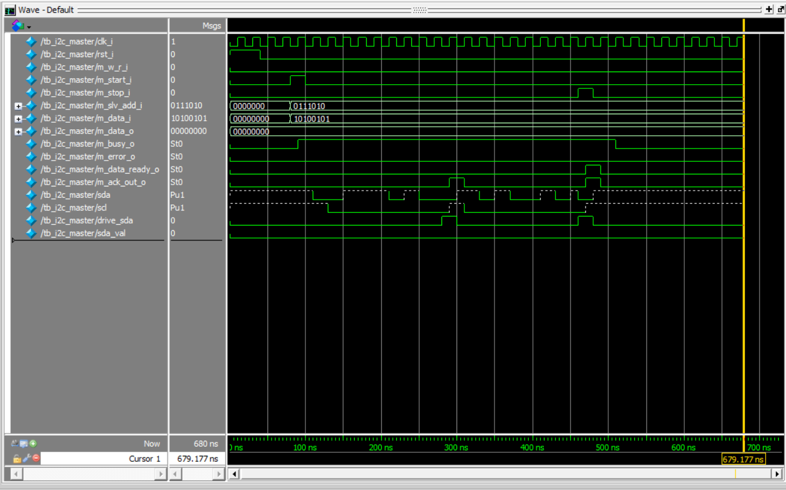

# i2c_Final_Project

A synthesizable I2C Master Controller implementation in Verilog HDL, fully validated using ModelSim simulation.

## Overview

This project implements an FSM-driven I2C Master controller capable of driving standard I2C bus transactions. The design handles start/stop condition generation, slave address framing, data transmission, and tri-state bidirectional SDA line management.

## Core Features

* **State Machine Architecture:** FSM controlling Start, Address, Data Write, ACK, and Stop states.
* **Open-Drain Bus Logic:** Bidirectional `sda` and `scl` lines utilizing standard tri-state (`1'bz`) assignment.
* **Testbench Verification:** Simulated slave ACK responses to verify end-to-end write transactions.
* **Status Flags:** Real-time monitoring via `m_busy_o`, `m_error_o`, and `m_data_ready_o`.

## File Structure

* `i2c_master.v`: RTL module containing the I2C Master controller logic.
* `tb_i2c_master.v`: Testbench simulating master transactions and slave ACK timing.

## Simulation Waveform

The simulation demonstrates a complete write transaction to slave address `0x3A` (`0111010`) with data payload `0xA5` (`10100101`):

### Key Transaction Steps:
1. **Start Condition:** `sda` pulled low while `scl` remains high.
2. **Address Frame:** Master transmits 7-bit slave address + Write bit (`0`).
3. **Slave ACK:** Slave pulls `sda` low on the 9th clock cycle.
4. **Data Frame:** Master shifts out byte `0xA5`.
5. **Stop Condition:** `sda` transitions from low to high while `scl` is high.

## Tools Used

* **Language:** Verilog HDL
* **Simulator:** ModelSim / QuestaSim (Intel FPGA Edition)
